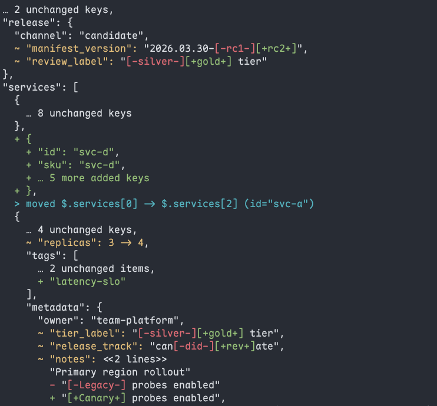

# jsondiffview

A review-oriented JSON diff for your terminal.

`jdv` compares two JSON documents and renders a human-readable diff that follows the structure of JSON itself. Instead of a flat patch list, the output looks like annotated JSON — you see what changed, where it moved, and what stayed the same, all in context.

The package published on PyPI is named `jsondiffview`, but the installed CLI command remains `jdv`.

## Quick start

```
pip install jsondiffview
```

Or with [uv](https://docs.astral.sh/uv/):

```
uv tool install jsondiffview
```

Then compare two files:

```
jdv before.json after.json
```



`+` marks additions. `-` marks removals. `~` marks modifications. `>` marks provenance notes (moves and removals). Unchanged siblings are collapsed into `…` summaries. Within modified strings, `[-old-]` and `[+new+]` highlight exactly what changed — with or without terminal colors.

## View modes

`jdv` offers three view modes that share the same underlying diff — they only differ in how much context is shown.

| Mode | Flag | Purpose |
|---|---|---|
| **compact** | *(default)* | Collapses unchanged context and summarizes large add/remove blocks. Best for a quick overview. |
| **focus** | `--view focus` | Shows the full changed material while still collapsing unchanged siblings. |
| **full** | `--view full` | Expands everything — unchanged context, full subtrees — for complete review. |

```
jdv --view focus before.json after.json
jdv --view full --color never before.json after.json
```

## String diffs

`jdv` automatically picks the best rendering for each string change.

**Short strings** get inline token-level diffs — whole words are replaced, not individual characters:

```
  ~ "review_label": "[-silver-][+gold+] tier"
```

**Single-token edits** that share a clear prefix/suffix show finer detail:

```
  ~ "release_track": "can[-did-][+rev+]ate"
```

**Multiline strings** are displayed as logical-line diffs with context:

```
  ~ "notes": <<2 lines>>
      "Primary region rollout"
    - "[-Legacy-] probes enabled"
    + "[+Canary+] probes enabled"
```

**Long single-line payloads** (base64, JWTs, query strings, etc.) are summarized as hunk excerpts so they don't flood the terminal:

```
  ~ "session_fingerprint": string changed (264 -> 280 chars, 1 hunks)
      … 140 chars of unchanged prefix omitted …
    - "...token=[-abc123-]BBBB..."
    + "...token=[+def456+]BBBB..."
      … 128 chars of unchanged suffix omitted …
```

## Array matching

`jdv` recognizes "the same item" in arrays by two high-confidence signals — it never guesses by position alone.

**Identity keys.** By default, objects in arrays are matched by `id`, `key`, `name`, or `title`. When an item moves to a new index, `jdv` reports the move rather than showing a remove/add pair:

```
  > moved $.services[0] -> $.services[2] (id="svc-a")
```

You can supply your own keys with `--match-key` (replaces defaults):

```
jdv --match-key sku --match-key variant_id before.json after.json
```

**Exact value.** If no identity key is available but the entire value is byte-for-byte identical, `jdv` still recognizes it as the same item and can report it as moved.

Items that cannot be matched by either signal are shown as remove + add — `jdv` does not fabricate matches.

## CLI reference

```
Usage: jdv [OPTIONS] OLD_JSON NEW_JSON
```

| Option | Short | Default | Description |
|---|---|---|---|
| `--view` | `-v` | `compact` | Review mode: `compact`, `focus`, or `full`. |
| `--match-key FIELD` | `-k` | `id key name title` | Identity key for array objects. Repeat to set multiple. Replaces defaults when given. |
| `--color` | `-c` | `auto` | Color mode: `auto`, `always`, or `never`. |
| `--quiet` | `-q` | off | Suppress the "No semantic differences." notice on stderr. |
| `--version` |  | off | Show the installed `jdv` version and exit. |

Either argument may be `-` to read from stdin (but not both).

**Exit codes:** `0` = no differences (stdout is empty), `1` = differences found, `2` = error (invalid input, parse failure, etc.).

## Strict JSON

`jdv` rejects ambiguous input before comparing:

- Duplicate object keys cause an immediate error.
- `NaN`, `Infinity`, `-Infinity`, and overflowed literals like `1e999` are rejected.
- `true`, `1`, `1.0`, and `"1"` are all treated as distinct values.

## Color

When stdout is a terminal (or with `--color always`), `jdv` applies colors:

- `~` lines and field labels: **yellow**
- `[-removed-]` spans: **red**
- `[+added+]` spans: **green**
- `>` provenance notes: **cyan**
- Unchanged text: default terminal color

Colors only enhance — all diff semantics are readable in plain text through `~`, `+`, `-`, `[-…-]`, and `[+…+]` markers.

## Development

```
uv sync
uv run python -m jdv --help
uv run jdv --version
uv run pytest -q
uv build --no-sources
```
